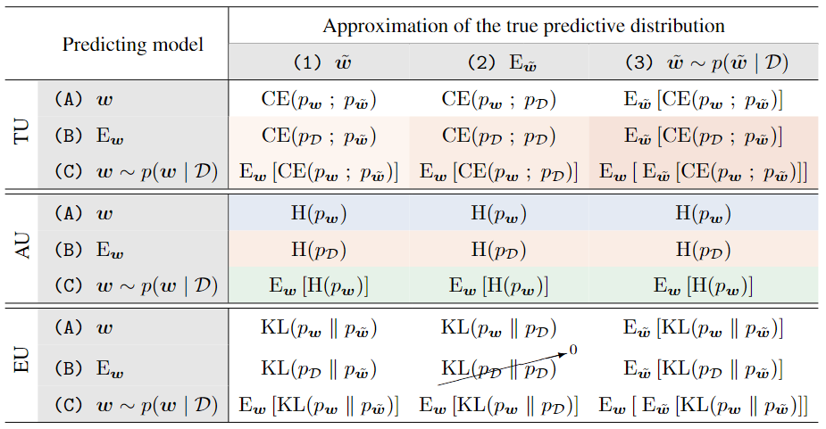

# On Information-Theoretic Measures of Predictive Uncertainty

[](https://arxiv.org/abs/2410.10786)
[](LICENSE)

Kajetan Schweighofer<sup>1*</sup>, Lukas Aichberger<sup>1*</sup>, Mykyta Ielanskyi<sup>1</sup>, Sepp Hochreiter<sup>1,2</sup>

$^1$ ELLIS Unit, LIT AI Lab, Institute for Machine Learning, JKU Linz, Austria  
$^2$ NXAI GmbH, Linz, Austria  
$^*$ Joint first authors  

## Summary

This work presents an framework of information-theoretic predictive uncertainty measures, based on the predicting model and the approximation of the true predictive distribution.
The following code was used to perform all reported experiments in the paper.
An efficient implementation of the Monte-Carlo estimators of all measures is provided in [uncertainty_measures.py](source/utils/uncertainty_measures.py).




## Setup

To change where the datasets are loaded, results are stored, etc. change paths in [constants.py](source/constants.py).
The environment can be installed via
```
conda env create -f environment.yml
conda activate unc
```

## Replicate experiments

The active learning experiments are independent of all other experiments.
For the other experiments, models for Deep Ensembles and MC Dropout are necessary to be trained first.
Based on them, adversarial examples can be generated.

The next step is to obtain predictive distributions to be analyzed later on.
Those are obtained via the eval_x.ipynb files.
Note that for the Laplace Approximation we do not store individual models, but directly obtain predictive distributions in the [eval_laplace.ipynb](eval_laplace.ipynb) file, utilizing the MAP models from the respective Deep Ensemble run.

Finally, all experiments are investigated in the respective analyze_x.ipynb files, which generate all plots.


### Active Learning

The active learning experiments are conducted by

```
./run_active_learning_DE.sh
./run_active_learning_MCD.sh
```

Afterwards, results can be analyzed in [analyze_active_learning.ipynb](analyze_active_learning.ipynb)

### Other experiments

#### Deep Ensembles and MC Dropout

Raw models for Deep Ensembles and MC Dropout are trained by

```
./run_train_ensemble.sh
./run_train_mcdropout.sh
```

They are evaluated using the [eval_ensemble.ipynb](eval_ensemble.ipynb), [eval_ensemble_cifar10_c.ipynb](eval_ensemble_cifar10_c.ipynb), [eval_mcdropout.ipynb](eval_mcdropout.ipynb) and [eval_mcdropout_cifar10_c.ipynb](eval_mcdropout_cifar10_c.ipynb) files.
Note however, that the [eval_ensemble.ipynb](eval_ensemble.ipynb) and [eval_mcdropout.ipynb](eval_mcdropout.ipynb) notebook also provide predictive distributions for adversarial examples, thus it is advisable to generate them first.

#### Adversarial Example Detection

After all models are trained for Deep Ensembles and MC Dropout, adversarial examples can be generated via

```
./generate_adversarial_examples.sh
```

#### Laplace Approximation

The laplace approximation can also only be done upon having runs for Deep Ensembles finished, as the MAP models are individual models of the Deep Ensemble.
Predictions are obtained in [eval_laplace.ipynb](eval_laplace.ipynb) and [eval_laplace_cifar10_c.ipynb](eval_laplace_cifar10_c.ipynb) for the distribution shift experiments. 

## Contact

If you have any questions around the code or the paper itself, feel free to reach out to schweighofer@ml.jku.at

## Citation

If you find this work useful, please cite

```
@article{schweighofer2024measures,
    title={On Information-Theoretic Measures of Predictive Uncertainty}, 
    author={Kajetan Schweighofer and Lukas Aichberger and Mykyta Ielanskyi and Sepp Hochreiter},
    journal={arXiv preprint arXiv:2410.10786},
    year={2024}
}
```
